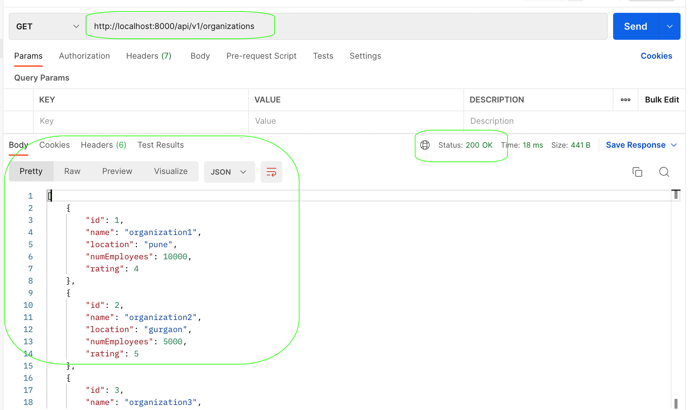
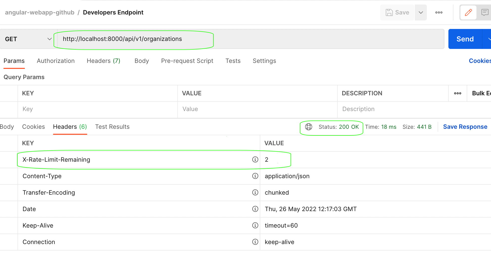
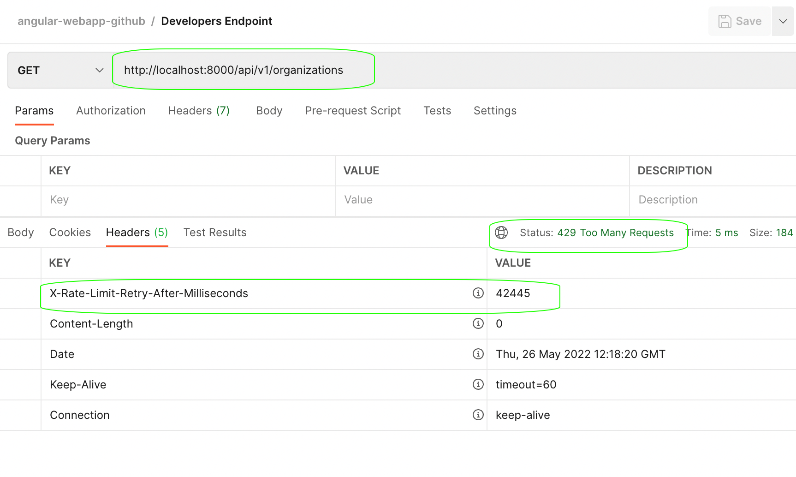

##  Spring Boot Custom Rate Limiter

---

### Information about the project

*   This project consists of two modules : 
    *   ***spring-boot-starter-custom-rate-limiter*** : Spring Boot Starter for the custom Rate Limiter. 
    *   ***spring-boot-custom-rate-limiter-rest*** : REST Api using the custom Rate Limiter Starter.
   
---

### Installation

*   Simply set up this maven project. 
*   Run the file ***com.spring.boot.rest.SpringBootCustomRateLimiterRestApplication*** in REST Api module project.

----

### Test Results

*   ***Request Hit - Success Response*** 

---

*   ***Request Hit - Success Response Headers showing the limit remaining***

---

*   ***Request Hit - Failure Response once limit is reached***

---